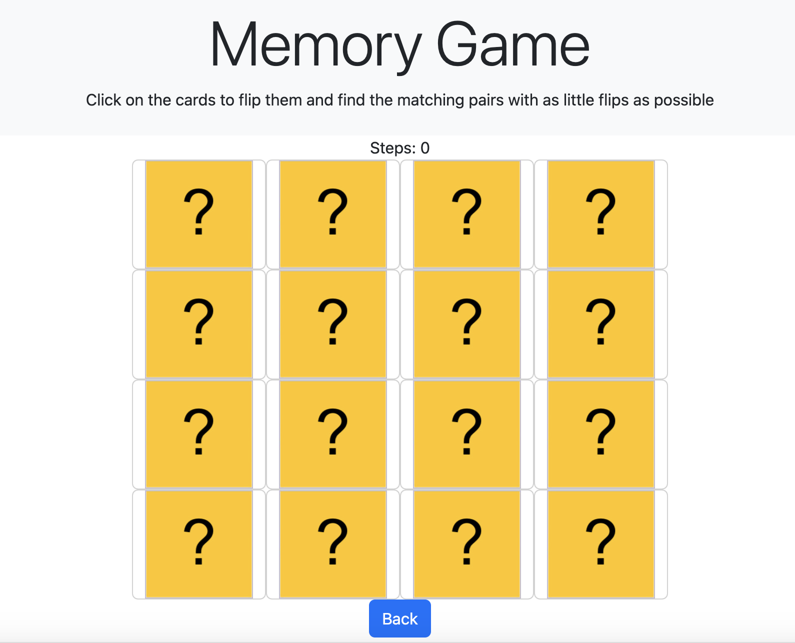
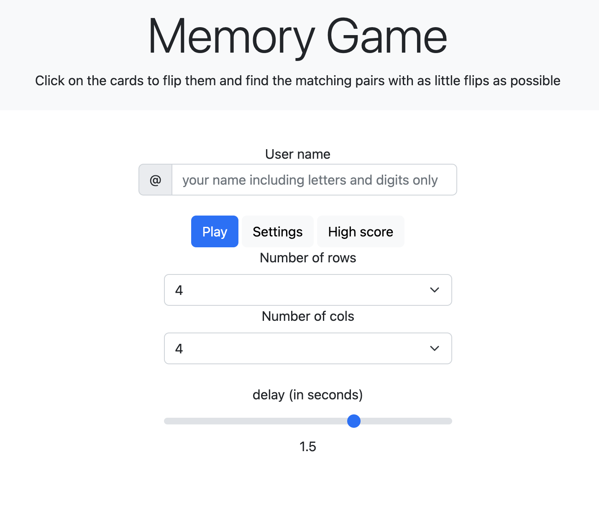
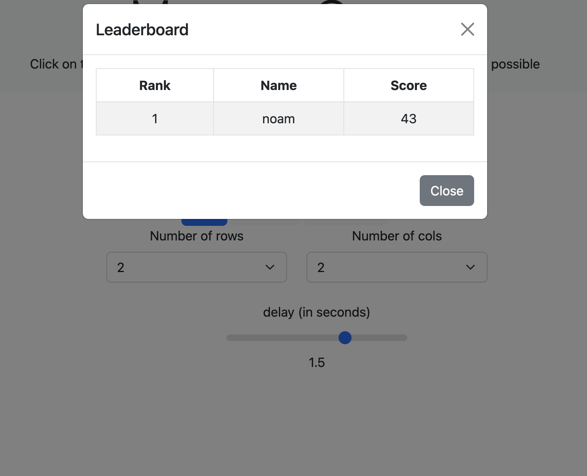

# 🧠memory game in js 🧠

<h3>Author: Noam Mirjani </h3>

Welcome to the Memory Match Game! In this game, you can select the number of rows
and columns for a grid of cards, and then click on the cards to flip them over and try to match pairs. The game tracks your score and allows you to enter your name to view the high scores.

<h3> Table of Contents</h3>

<h5> Usage</h5>
<h5> Dependencies</h5>
<h5> License</h5>

<h3> Usage </h3>
To play the game, open the index.html file in a web browser and follow the prompts to select the number of rows and columns for the game, enter your name, and start playing. Click on cards to flip them over and try to match pairs. When the game is over, your score will be displayed and you can enter your name to view the high scores.

<h3> Dependencies</h3>

This code requires the following external libraries:

Bootstrap for styling and layout

<h3> License</h3>